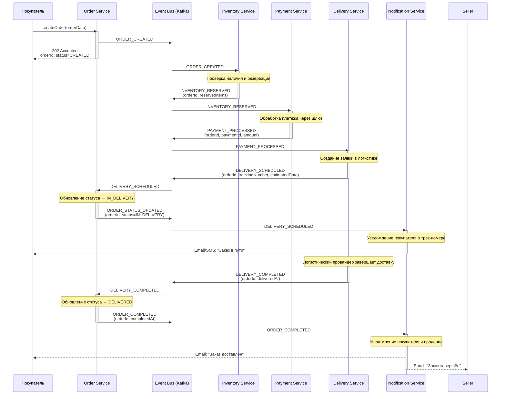
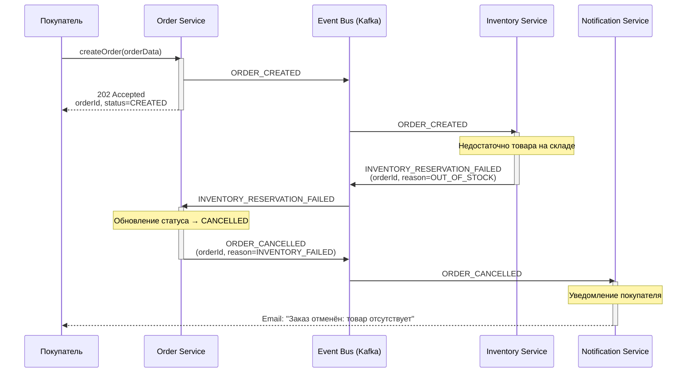
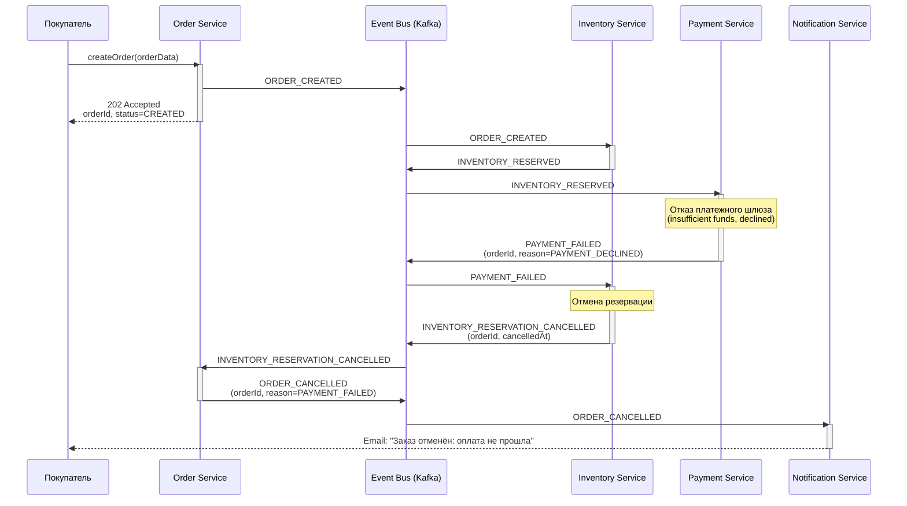
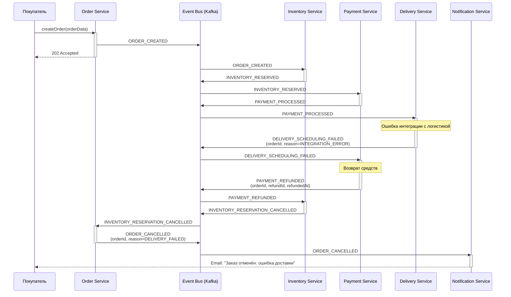

# Проектирование приложения на базе EDA

## **Реестр событий для Saga-хореографии**
|  №  | Этап                         | Тип события  | Название                        | Сервис    | Комментарий                                          |
|:---:|:-----------------------------|:-------------|:--------------------------------|:----------|:-----------------------------------------------------|
|  1  | Заказ создан                 | domain       | ORDER_CREATED                   | order     | Статус: «Создан»                                     |
|     |                              |              |                                 |           |                                                      |
|  2  | Товар зарезервирован         | domain       | INVENTORY_RESERVED              | inventory | Статус: «Ожидает оплаты»                             |
| 2.1 | Ошибка резервации            | failure      | INVENTORY_RESERVATION_FAILED    | inventory | → ORDER_CANCELLED                                    |
| 2.2 | Отмена резервации            | compensation | INVENTORY_RESERVATION_CANCELLED | inventory |                                                      |
|     |                              |              |                                 |           |                                                      |
|  3  | Оплата успешна               | domain       | PAYMENT_PROCESSED               | payment   | Статус: «Оплачен и готовится к отправке»             |
| 3.1 | Оплата не удалась            | failure      | PAYMENT_FAILED                  | payment   | → INVENTORY_RESERVATION_CANCELLED                    |
| 3.2 | Возврат средств              | compensation | PAYMENT_REFUNDED                | payment   |                                                      |
|     |                              |              |                                 |           |                                                      |
|  4  | Доставка создана             | domain       | DELIVERY_SCHEDULED              | delivery  | Статус: «Передан в доставку»                         |
| 4.1 | Создание доставки не удалась | failure      | DELIVERY_SCHEDULING_FAILED      | delivery  | → PAYMENT_REFUNDED → INVENTORY_RESERVATION_CANCELLED |
| 4.2 | Отмена доставки              | compensation | DELIVERY_CANCELLED              | delivery  |                                                      |
|     |                              |              |                                 |           |                                                      |
|  5  | Доставка завершена           | domain       | DELIVERY_COMPLETED              | delivery  | Статус: «Доставлен»                                  |
|     |                              |              |                                 |           |                                                      |
|  6  | Заказ завершён               | domain       | ORDER_COMPLETED                 | order     | Финальное состояние после DELIVERY_COMPLETED         |
|     |                              |              |                                 |           |                                                      |
|  7  | Заказ отменён                | domain       | ORDER_CANCELLED                 | order     | Инициируется при любом failure-событии               |

## Диаграммы последовательности

### 1. Успешный сценарий (Happy Path)

### 2. Ошибка резервации товара

### 3. Ошибка оплаты

### 4. Ошибка создания доставки

